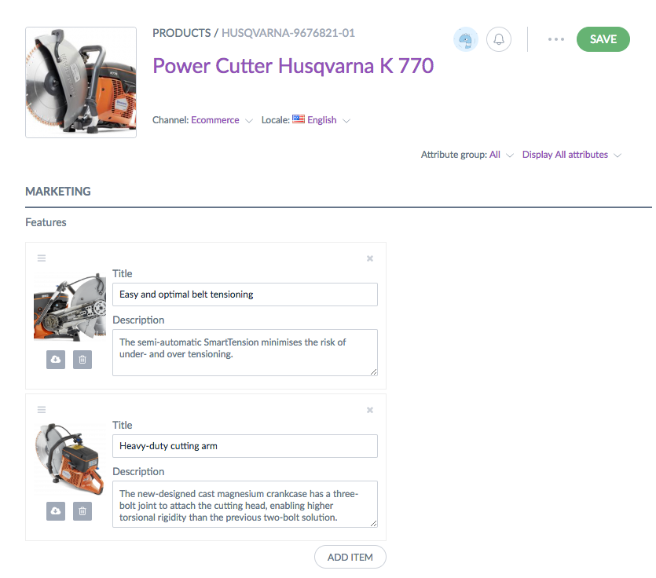
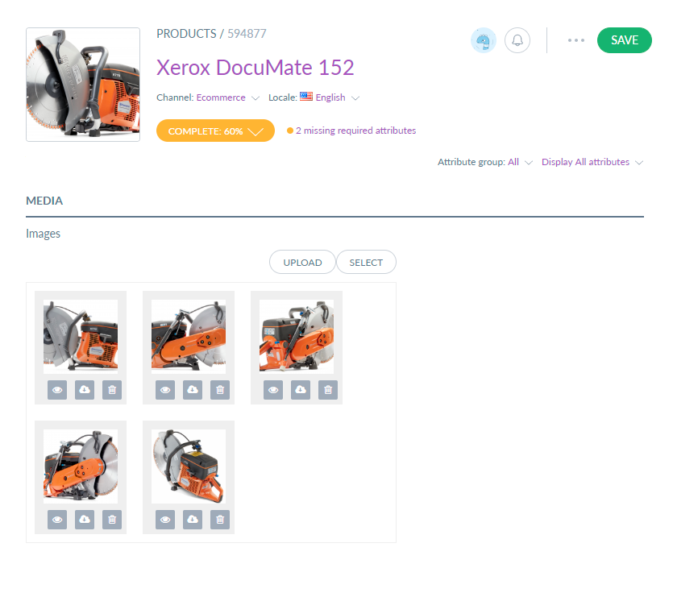

# ExtendedAttributeTypeBundle

Provides new attributes types for Akeneo PIM CE:
- FeaturesList: this attribute type can store an ordered collection text blocks with images.

ver. 0.1

# Todo:
for all attribute types add datagrid cell view and filter

FeaturesAttributeType
- Validation
- Copier ?
- Import/Export
- Elasticsearch
- Tests

ImageCollectionAttributeType
- Import/Export
- Elasticsearch
- Tests

YoutubeAttributeType
- Validation
- Import/Export
- Elasticsearch
- Tests
- переписать с использованием api и проверкой на статус ссылки 

Country attribute type
- all
